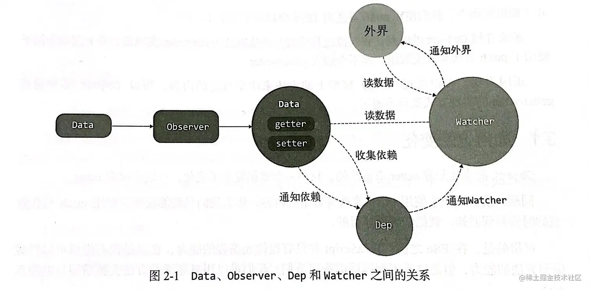

# 发布-订阅模式

::: info 原理
一种对象间一对多的依赖关系，当一个对象的状态发生改变，所有依赖于它的对象将得到状态改变的通知
:::

## 具体实现
* **Watcher**：每个绑定了数据的视图（如DOM元素）都会有一个对应的 `Watcher` 实例，它用于监听数据的变化。
* **Dep**：每个数据项（如对象的属性）都会有一个 `Dep` 实例，`Dep` 是数据的发布者，记录着所有的 `Watcher`（订阅者）依赖于它。
* **Dep 和 Watcher 的关系**：
    * 当视图首次渲染时，`Watcher` 会通过 `getter` 函数读取数据，并将自己添加到 `Dep` 的订阅列表中（即数据的订阅者）。
    * 当数据发生变化时，`Dep` 会通知所有依赖该数据的 `Watcher`，触发视图的更新。

## 使用场景
### 组件之间的数据传递（父子通信）
::: info 原理
Vue组件通常通过 props 和 events 进行数据传递。当父组件的属性值发生变化时，子组件会自动更新。发布订阅模式在这个场景下保证了子组件能够及时获取父组件传递的数据变化。
:::

发布订阅模式在其中的作用：
* 父组件通过 `props` 向子组件传递数据。
* 子组件通过 `Watcher` 订阅父组件的响应式数据，一旦父组件的数据变化，子组件会自动更新。

### 表单输入、用户交互
::: info 原理
表单控件的输入数据通常是响应式的，用户的交互会引起数据的变化，并且这时视图也需要随之更新。
:::

更新过程：
* 用户输入触发事件：用户在表单输入框输入时，会触发 `input` 事件。
* v-model 双向绑定：通过 `v-model` 指令，用户输入会更新数据模型（如 `message`）。
* 数据变化：数据模型（message）的变化通过响应式系统触发。
* 依赖收集：Vue 会通过 `getter` 收集依赖，将 `Watcher` 与 `message` 属性绑定。
* 视图更新：数据变化后，`Watcher` 触发视图更新，确保 `DOM` 显示的值与数据同步。
* 视图与数据同步：输入框的值更新为最新的 `message` 数据，完成双向绑定。

发布订阅模式在其中的作用：
* 用户输入会改变响应式数据，触发 `setter`。
* 绑定到数据的 DOM 元素通过 `Watcher` 订阅数据变化，自动更新视图。

### 计算属性
::: info 原理
计算属性是依赖其他响应式数据的派生值，它们在依赖的数据变化时会重新计算。
:::

发布订阅模式在其中的作用：
* Vue会通过 `Watcher` 监控计算属性依赖的数据，当这些数据发生变化时，计算属性会重新计算并更新视图。

### 异步更新
::: info 原理
当网络请求返回数据后，Vue需要自动更新视图。
:::

发布订阅模式在其中的作用：
* 当请求返回数据时，响应式数据会更新。
* Vue会通过 `Dep` 和 `Watcher` 通知相关组件的视图进行更新。
